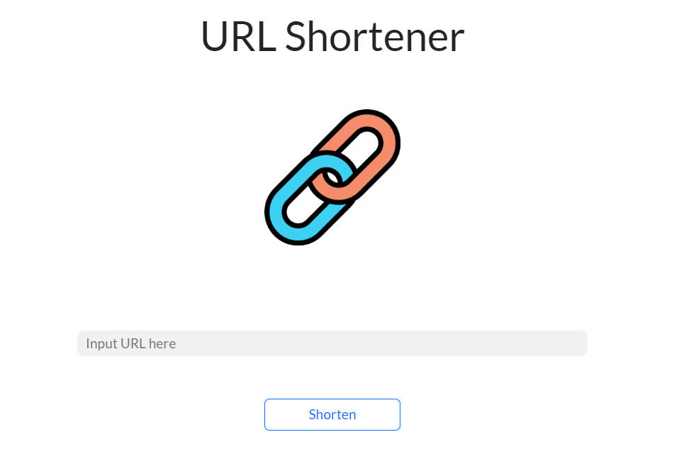

# URL-Shortener
短網址的目的是，由伺服器產生一組短的網址，以代替原來可能較長的網址，並讓使用者可以在其他地方任意使用。

## Screen Photos

## Get Start
1. 確保已安裝好Node.js
2. 透過終端輸入指令將此專案clone到你的本機 : git clone https://github.com/AlanSquid/URL-Shortener.git
3. 在專案資料夾內安裝npm套件 : npm install
4. 環境變數設置: 
> MONGODB_SHORTENER_URI="MongoDB connection string"
5. 執行: npm run start
6. 執行成功終端會顯示: Express is listening on http://localhost:3000
7. 欲結束執行可在終端輸入ctrl + C

## Built With
- Node.js: 16.17.0
- express: 4.18.2
- express-handlebars: 6.0.6
- mongoose: 6.6.5
- bootsrap: 5.2